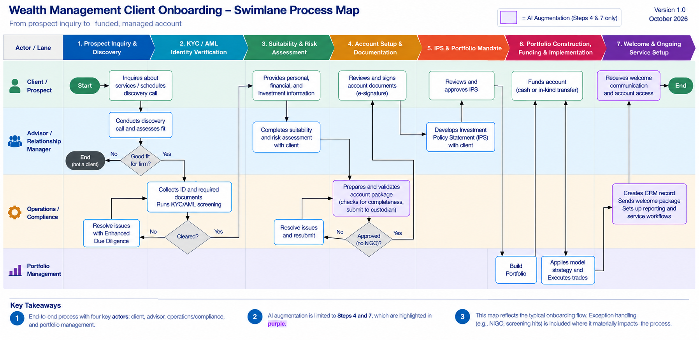
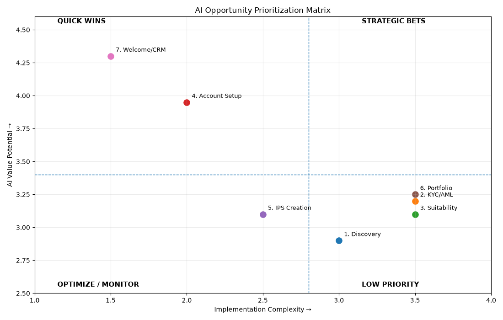

# AI Opportunity Assessment: Wealth Management Client Onboarding
**Author** - Christopher Biroc | **Updated** - October 2026

This project looks at where AI could realistically be used within a 7-step wealth management client onboarding process. The goal was not to assume that every part of onboarding should be automated. Instead, each step was evaluated on how feasible AI automation would be, how much usable data is available, how often the step occurs, how much process friction it creates, and the regulatory risk involved. The result is a prioritized list of AI opportunities, a recommended initial scope (Steps 4 and 7), and the requirements, risk controls, and business case to support it.

## Repository Guide

| Folder | File | What it contains |
|---|---|---|
| `process_documentation/` | [`process_narrative.md`](process_documentation/process_narrative.md) | Step-by-step narrative of the 7-step onboarding process and the regulations tied to each step |
| `deliverables/` | [`swimlane_diagram.png`](deliverables/swimlane_diagram.png) | Swimlane process map (Steps 4 and 7 highlighted as the AI augmentation points) |
| `deliverables/` | [`opportunity_matrix.xlsx`](deliverables/opportunity_matrix.xlsx) | Anchor rubric, scored matrix with composite scores and tiers, and score rationale for every rating |
| `analysis/` | [`AI_augmentation_analysis.pdf`](analysis/AI_augmentation_analysis.pdf) | Step-by-step analysis of where to augment with AI, using both scoring views |
| `analysis/` | [`prioritization_matrix_2x2_graph.png`](analysis/prioritization_matrix_2x2_graph.png) and [`prioritization_matrix.py`](analysis/prioritization_matrix.py) | Implementation Complexity vs. AI Value Potential chart and the Python script that builds and saves it (code shown in the Assessment Methodology section) |
| `deliverables/` | [`business_case_brief.pdf`](deliverables/business_case_brief.pdf) | One-page business case: problem, recommendation, impact, and risks |
| `deliverables/` | [`time_savings_table.pdf`](deliverables/time_savings_table.pdf) | Directional per-step estimates of advisor time, client time, and cycle-time savings |
| `data/` | [`requirements_document.md`](data/requirements_document.md) | User stories and acceptance criteria for the two selected improvements |
| `data/` | [`scoring_data_sources.md`](data/scoring_data_sources.md) | Research sources and links used to support the scoring |
| `governance/` | [`ai_risk_considerations.md`](governance/ai_risk_considerations.md) | Risks and controls for the two selected AI opportunities |

## Business Problem

Client onboarding can be a time-consuming process for wealth management firms. The biggest issues are generally related to collecting information, KYC/AML verification, account documentation, and the amount of manual work required to move information between steps. Industry research supports this. McKinsey found that KYC due diligence and account opening can account for more than 40% of the time spent onboarding a customer. Intelliflo's 2024 Advice Efficiency Survey reported an average of roughly 15 hours spent onboarding a new client, with 60% of that time not spent directly with the client. F2 Strategy's 2026 research found that 72% of the wealth-management firms it surveyed identified onboarding as a key source of friction. The purpose of this project was to identify which parts of that process are good candidates for AI and which should continue to require human involvement.

## Process Overview

The assessment covers seven steps:

1. Prospect Inquiry & Discovery Call
2. KYC/AML Identity Verification
3. Suitability & Risk Tolerance Assessment
4. Account Setup & Documentation
5. Investment Policy Statement (IPS) & Portfolio Mandate
6. Portfolio Construction, Funding & Investment Implementation
7. Welcome & Ongoing Service Setup

The process involves the prospect/client, advisor, compliance/operations, and portfolio management. Each step was also reviewed for the regulatory requirements that apply to it, including Regulation Best Interest, FINRA suitability requirements, KYC/AML requirements, and fiduciary responsibilities. The full narrative is in [`process_documentation/process_narrative.md`](process_documentation/process_narrative.md).



## Assessment Methodology

Each step was scored from 1-5 across five categories. The categories were weighted based on how important each factor was to the overall AI opportunity.

| Dimension | Weight | What it measures |
|---|---|---|
| Automation Feasibility | 30% | How structured and repeatable the work is |
| Data Availability | 25% | Whether the information needed is available and usable |
| Time & Volume Benchmarks | 20% | How often the activity occurs and how many clients it touches |
| Process Friction / Failure Exposure | 15% | How much delay, rework, or hand-off the activity creates |
| Risk Level (inverse) | 10% | The regulatory and fiduciary risk created by automating the activity |

The project uses two views of the results:

- **Composite / Tier (primary).** The weighted score assigns each step to a tier: 
    **Quick Win** (4.00 or higher) 
    **Near-Term** (3.00-3.99) 
    **Low Priority** (below 3.00) 
    A step can be manually downgraded when regulatory or governance concerns outweigh the calculated score.
- **Implementation Complexity vs. AI Value Potential (2x2).** This is a stricter implementation view that plots the same scores on two axes, shown below.

The two views do not always agree. A step can score well on the composite but still be held back by implementation complexity, data availability, or regulatory risk, and the analysis keeps both views to show where that happens.



<details open>
<summary><b>Python code that builds the chart</b> (<code>analysis/prioritization_matrix.py</code>)</summary>

```python
# AI Opportunity Prioritization Matrix
# y = AI Value Potential = Composite Score column from the Scored Matrix tab (workbook's own weighted blend of all 5 scoring dimensions)
# x = Implementation Complexity = 6 - avg(Data Availability, Risk Level Inverse)- low data access or high regulatory risk pushes complexity up
from pathlib import Path

import matplotlib.pyplot as plt

# Scores below are copied from the Scored Matrix tab of deliverables/opportunity_matrix.xlsx
steps = {
    "1. Discovery": (3.0, 2.90),
    "2. KYC/AML": (3.5, 3.20),
    "3. Suitability": (3.5, 3.10),
    "4. Account Setup": (2.0, 3.95),
    "5. IPS Creation": (2.5, 3.10),
    "6. Portfolio": (3.5, 3.25),
    "7. Welcome/CRM": (1.5, 4.30),
}

# Thresholds
complexity_threshold = 2.8
value_threshold = 3.4

# Automatically classify each opportunity
def quadrant(complexity, value):
    if complexity < complexity_threshold and value >= value_threshold:
        return "Quick Wins"
    elif complexity >= complexity_threshold and value >= value_threshold:
        return "Strategic Bets"
    elif complexity >= complexity_threshold and value < value_threshold:
        return "Low Priority"
    else:
        return "Optimize / Monitor"

# Create matrix
fig, ax = plt.subplots(figsize=(11, 7))

for step, (complexity, value) in steps.items():
    ax.scatter(complexity, value, s=90)
    ax.annotate(
        step,
        (complexity, value),
        xytext=(8, 7),
        textcoords="offset points",
        fontsize=9
    )

# Draw quadrant thresholds
ax.axvline(complexity_threshold, linestyle="--", linewidth=1)
ax.axhline(value_threshold, linestyle="--", linewidth=1)

# Quadrant labels
ax.text(1.15, 4.55, "QUICK WINS", fontsize=11, fontweight="bold")
ax.text(3.15, 4.55, "STRATEGIC BETS", fontsize=11, fontweight="bold")
ax.text(1.15, 2.55, "OPTIMIZE / MONITOR", fontsize=11, fontweight="bold")
ax.text(3.15, 2.55, "LOW PRIORITY", fontsize=11, fontweight="bold")

# Formatting
ax.set_xlim(1.0, 4.0)
ax.set_ylim(2.5, 4.6)
ax.set_xlabel("Implementation Complexity →")
ax.set_ylabel("AI Value Potential →")
ax.set_title("AI Opportunity Prioritization Matrix")
ax.grid(True, alpha=0.25)

plt.tight_layout()

# Save the chart next to this script so the repo always has the latest version
output_path = Path(__file__).with_name("prioritization_matrix_2x2_graph.png")
plt.savefig(output_path, dpi=100)
plt.show()

# Print classifications
print("Quadrant classification:")
for step, (complexity, value) in steps.items():
    print(f"{step}: {quadrant(complexity, value)}")
```

</details>

| Step | Composite | Final Tier | 2x2 Quadrant |
|---|---|---|---|
| 1. Prospect Discovery | 2.90 | Low Priority | Low Priority |
| 2. KYC/AML Verification | 3.20 | Near-Term | Low Priority |
| 3. Suitability & Risk Assessment | 3.10 | Near-Term | Low Priority |
| 4. Account Setup & Documentation | 3.95 | Near-Term | Quick Win |
| 5. IPS & Portfolio Mandate | 3.10 | Near-Term | Optimize / Monitor |
| 6. Portfolio Construction & Funding | 3.25 | Low Priority (manual override) | Low Priority |
| 7. Welcome & Ongoing Service Setup | 4.30 | Quick Win | Quick Win |

The rubric anchors and the rationale behind every score are in [`deliverables/opportunity_matrix.xlsx`](deliverables/opportunity_matrix.xlsx), and the research behind the scoring is in [`data/scoring_data_sources.md`](data/scoring_data_sources.md).

## Key Findings

### 1. Welcome & Ongoing Service Setup scored the highest
Step 7 received the highest composite score at **4.30**, making it the only step classified as a Quick Win by the composite method, and it is also a Quick Win in the 2x2. The work is rule-based, happens for every client, and carries lower regulatory risk than suitability or investment recommendations, which makes it a good starting point for client communications, CRM updates, and service setup. This lines up with Deloitte's 2026 recommendation to deploy agentic AI first in onboarding, service requests, and CRM follow-up because risk is lower and data is more available.

### 2. Account Setup is the strongest friction target, and KYC/AML is held back by complexity
Step 4 has the highest Process Friction / Failure Exposure score in the matrix (5/5) and a **3.95** composite, just under the Quick Win line, and it is a Quick Win in the 2x2. McKinsey's finding that KYC due diligence and account opening can consume more than 40% of onboarding time supports looking closely at both areas. KYC/AML (Step 2) is a different case: it scores Near-Term on the composite (3.20) but lands in Low Priority in the 2x2 because documents have to be collected fresh (data availability 2/5) and flagged results require compliance review. For that reason it is outside the initial scope.

### 3. Regulatory risk limits the use of AI in suitability and investment decisions
Portfolio Construction & Funding received a **3.25** composite score, which would normally put it in the Near-Term category. It was manually downgraded to **Low Priority** because of the regulatory and fiduciary considerations involved when AI is used around investment recommendations. Suitability (Step 3) has the next-lowest inverse risk score (2/5). FINRA's 2026 Annual Regulatory Oversight Report emphasizes supervision and human-in-the-loop review when GenAI is used. The takeaway is that AI can support the process, but the recommendation and final decision should remain under human oversight.

## Recommendations

The recommended initial scope is **Steps 4 and 7 only**. The other five steps either scored lower or require a level of advisor judgment that makes them less appropriate for early automation.

### 1. Start with Welcome & Ongoing Service Setup (Step 7)
Automate the routine, rule-based work: CRM record creation, welcome communications, scheduling the first review, and setting up the reporting cadence. Judgment-based communications and non-standard requests should still be routed to staff for review. User Story 2 and its acceptance criteria are in [`data/requirements_document.md`](data/requirements_document.md).

### 2. Add AI document assembly and pre-submission checks to Account Setup (Step 4)
Pre-populate account documents from existing CRM data, validate them for completeness and consistency before they reach the custodian, and route exceptions to operations staff. The goal is to reduce rework, not to remove supervisory review. User Story 1 and its acceptance criteria are in [`data/requirements_document.md`](data/requirements_document.md).

### 3. Keep humans involved where judgment is required
Regulatory requirements should be treated as a constraint on the AI design, not something addressed after the technology is selected. For KYC/AML decisions, suitability assessments, IPS judgment, and investment recommendations, AI should support the advisor or compliance team rather than make the final decision. Controls for the two selected steps (exception review, sampling of cleared items, vendor review, ongoing monitoring, and a narrow scope) are in [`governance/ai_risk_considerations.md`](governance/ai_risk_considerations.md).

## Expected Impact
Industry research provides evidence that AI and workflow automation can reduce time spent on certain wealth management activities. McKinsey estimates that broader technology and generative AI adoption could produce 6-12% time savings, and Bain reports a 24-35% increase in revenue per adviser at wealth management firms that have adopted AI. These figures are industry benchmarks, not expected results for this project. The [`business_case_brief.pdf`](deliverables/business_case_brief.pdf) and [`time_savings_table.pdf`](deliverables/time_savings_table.pdf) give directional, per-step planning estimates, which are not measured results. A firm-specific estimate would require actual onboarding volumes, employee hours, current processing times, error/rework rates, and implementation costs.

## Tools Used

- **draw.io** — Process swimlane diagram
- **Excel** — Scoring rubric, opportunity matrix, and weighted calculations
- **Python / matplotlib** — AI opportunity prioritization visualization

## Disclaimer and AI Use

**Disclaimer.** This is an independent, educational portfolio project. It is not based on any firm's internal data, and it is not legal, compliance, investment, or financial advice. The scores, time-savings figures, and cost estimates are directional planning estimates rather than measured results, and the vendors and regulations mentioned are used as illustrative references. A real implementation would need review by a firm's compliance, legal, and information security teams.

**How AI was used.** I used Claude (Anthropic) as an assistant for specific tasks rather than to generate the project. I chose the process and scope, set the scoring dimensions and weights, made the scoring judgments, selected the research sources, and decided on the recommendations. AI helped with drafting and editing wording, pressure-testing the logic, and checking the documents for consistency. I reviewed what it produced, corrected it, and removed claims that could not be tied back to the sources in [`data/scoring_data_sources.md`](data/scoring_data_sources.md) or the scoring workbook. The final decisions and conclusions are mine.

## Key Sources

- **McKinsey & Company** — *Winning corporate clients with great onboarding*
- **Deloitte** — *The agentic AI productivity wave is heading for wealth management* (2026)
- **Intelliflo** — *2024 Advice Efficiency Survey*
- **McKinsey & Company** — *The Looming Advisor Shortage in US Wealth Management* (2025)
- **FINRA** — *2026 Annual Regulatory Oversight Report*
- **NIST** — *Artificial Intelligence Risk Management Framework (AI RMF 1.0)*

The complete source list, including supporting data and links, is available in [`data/scoring_data_sources.md`](data/scoring_data_sources.md).
